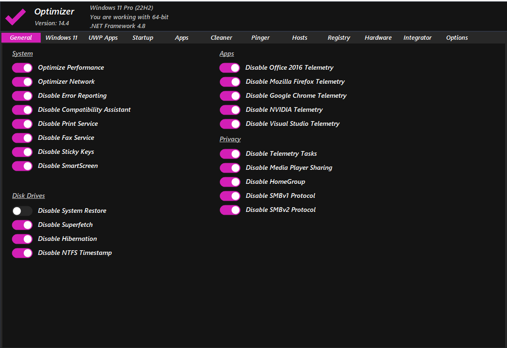
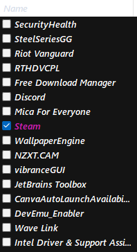
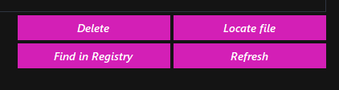
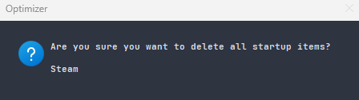

# An in-depth guide on optimizations for windows

	 
	

		
	

	 
	

		
		
        
    

**Date last updated:** 15 November 2022

**Winver:** 22H2 (to check winver version do WIN + R and type "winver" and press enter.)

**Note:** This guide is for windows 10 64-bit and 11 64-bit. If you are using windows 7 or 8, you can use this guide but some of the steps may not work. It is advised to make a backup of your computer before doing any of the steps in this guide. Here is a guide on how to [create a system restore point](https://support.microsoft.com/en-us/windows/create-a-system-restore-point-77e02e2a-3298-c869-9974-ef5658ea3be9). If you feel like anything is missing or needs to be changed, feel free to make a pull request or open an issue.

**Disclaimer:** I am not responsible for any damage done to your computer. This guide is for educational purposes only.

This guide is made by me, it's essentially a collection of tweaks and fixes. Some are by others, some are by me. If you want to use this guide, please give me credit. 

### **Table of Contents**

* [**General Tweaks**](#general-tweaks)
* [**Service Tweaks**](#service-tweaks)
* [**Gaming Tweaks**](#gaming-tweaks)
* [**Optional Tweaks**](#optional-tweaks)
* [**Visual Tweaks**](#visual-tweaks)
* [**BIOS Tweaks**](#bios-tweaks)
* [**Driver Tweaks**](#driver-tweaks)
* [**Programming Tools**](#programming-tools)
* [**Gaming Configs**](#gaming-configs)
* [**Credits and Useful Links**](#credits-and-useful-links)

### **General Tweaks**

---

1. Uninstall all unnecessary apps.

2. Make sure that you have the latest version of windows. As of current date it would be 22H2. 

3. Download this program [https://github.com/hellzerg/optimizer/releases](https://github.com/hellzerg/optimizer/releases) and continue following the guide.

For example, if you would like to keep print service on then you do not tick "Disable Print Service".

4. Disable all the unnecessary startup apps. To do this you want to go and open up Task Manager. Go to the Startup tab and disable all the apps that you do not use.

5. To complete this process you may need to go into regedit and the delete some startup keys from there, or you could use [https://github.com/hellzerg/optimizer/releases](https://github.com/hellzerg/optimizer/releases) and simply go to the Startup tab and select all the apps that you do not use and delete them.

Select startup apps.

Select all the apps that you do not use.

Click delete.

When you recieve the popup to delete all the selected startup items click yes. This deletes all the registry keys for the startup apps that you do not use.
 

6. Run Windows Disk Cleanup. WIN + R and type "cleanmgr.exe", then press enter. Choose your drive and press **OK**. Then select what you would like to clean up and hit **OK**.

8. Run Windows Defragment and trimmer. WIN + R and type "dfrgui.exe", then press enter. Select your drive and press Optimize or Analyze.

9. Change energy plan. Open control panel and search for power plan. Then select **show additional plans** and select **Ultimate Performance**.

10. Run SystemPropertiesAdvanced in WIN + R. Then hit settings for performance. Then select **Adjust for best performance**.

11. If you have external drives open up SystemPropertiesAdvanced and go to settings for Performance. Then go to advanced and under virtual memory select **No paging file**. This will disable the paging file on your external drives. **Do not do this on your main drive.**

12. Enable everything in System > Monitor > Graphics Settings > Default Graphics Settings. This will make your computer run smoother.

13. Disable Storage Sense.

14. WIN + R and type "msconfig". Then go to the Services tab and disable all the services that you do not use. Then go to the Boot tab and open up advanced options for your boot drive. Then select "Number of cores" and use all of your available cores. Go back to the Boot tab and change your timeout to 5 seconds for a mid-high end computer. 10 seconds for a low-mid end computer. And 20 seconds for a laptop.

15. Open an elevated command prompt and type "bcdedit /set increaseuserva 3072" and press enter. This will increase the amount of virtual memory that your computer can use. This will help with performance and crashes if you have a 32 bit system. **Do not do this on a 64 bit system.**

16. Open an elevated command prompt and type slmgr /ipk W269N-WFGWX-YVC9B-4J6C9-T83GX. Then set a KMS server by typing slmgr /skms kms8.msguides.com. Then activate windows by typing slmgr /ato. This will activate windows and make it enable all the features and remove the ugly watermark. Run slmgr /xpr to check if it worked.

### **Service Tweaks**

---

1. Disable Windows Defender. WIN + R and type "services.msc", then press enter. Scroll down to Windows Defender and double click it. Change the startup type to **disabled** and press **stop**.

2. Disable Windows Update. WIN + R and type "services.msc", then press enter. Scroll down to Windows Update and double click it. Change the startup type to **disabled** and press **stop**.

3. Disable Windows Update Delivery Optimization. WIN + R and type "services.msc", then press enter. Scroll down to Windows Update Delivery Optimization and double click it. Change the startup type to **disabled** and press **stop**.

4. Disable Windows Update Service Host. WIN + R and type "services.msc", then press enter. Scroll down to Windows Update Service Host and double click it. Change the startup type to **disabled** and press **stop**.

5. Disable Windows Update User Interface. WIN + R and type "services.msc", then press enter. Scroll down to Windows Update User Interface and double click it. Change the startup type to **disabled** and press **stop**.

6. Disable Windows Update Medic Service. WIN + R and type "services.msc", then press enter. Scroll down to Windows Update Medic Service and double click it. Change the startup type to **disabled** and press **stop**.

7. Disable Windows Update Network Diagnostics. WIN + R and type "services.msc", then press enter. Scroll down to Windows Update Network Diagnostics and double click it. Change the startup type to **disabled** and press **stop**.

8. Disable Windows Update Orchestrator. WIN + R and type "services.msc", then press enter. Scroll down to Windows Update Orchestrator and double click it. Change the startup type to **disabled** and press **stop**.

9. Disable Windows Update Readiness. WIN + R and type "services.msc", then press enter. Scroll down to Windows Update Readiness and double click it. Change the startup type to **disabled** and press **stop**.

10. Disable Windows Update Service Registration. WIN + R and type "services.msc", then press enter. Scroll down to Windows Update Service Registration and double click it. Change the startup type to **disabled** and press **stop**.

11. Disable Windows Update Service Manager. WIN + R and type "services.msc", then press enter. Scroll down to Windows Update Service Manager and double click it. Change the startup type to **disabled** and press **stop**.

12. Disable Windows Update Service Session Manager. WIN + R and type "services.msc", then press enter. Scroll down to Windows Update Service Session Manager and double click it. Change the startup type to **disabled** and press **stop**.

### **Gaming Tweaks**

---

[Process Lasso](https://bitsum.com/) is an advanced process priority optimization and system automation utility.

[https://www.msi.com/Landing/afterburner/graphics-cards](https://www.msi.com/Landing/afterburner/graphics-cards) is a graphics card overclocking utility.

[https://www.guru3d.com/files-details/display-driver-uninstaller-download.html](https://www.guru3d.com/files-details/display-driver-uninstaller-download.html) is a display driver uninstaller which you can bundle up with NVCleanstall to debloat your graphics card drivers [https://www.techpowerup.com/nvcleanstall/](https://www.techpowerup.com/nvcleanstall/).

[https://www.techpowerup.com/download/techpowerup-gpu-z/](https://www.techpowerup.com/download/techpowerup-gpu-z/) is a graphics card information utility.

Disable hardware acceleration on everything, your browser, discord etc. This will increase performance by a lot. 

Disable all ingame overlays. This will increase performance by a lot.

### **Optional Tweaks**

---

WPD is a privacy tool [https://wpd.app/](https://wpd.app/). It is a free and open source tool that allows you to disable telemetry and other privacy invasive features in Windows 10 and 11. It is recommended to use this tool if you are concerned about your privacy.

[https://www.bleachbit.org/](https://www.bleachbit.org/) is a disk cleaner for windows. **Recommended**

[https://www.oo-software.com/en/shutup10/update](https://www.oo-software.com/en/shutup10/update) an antispy tool for windows 10 and 11.

[https://www.speedguide.net/downloads.php](https://www.speedguide.net/downloads.php). This is a tool that will help you optimize your internet connection. It's called TCP Optimizer. You would want to download version 4.0.14. It's the latest version.

[https://github.com/auraside/HoneCtrl](https://github.com/auraside/HoneCtrl) a windows bat script. Aimed to optimize your computer for general use and gaming. 

A windows tool that allows you to achive maximum productivity [https://github.com/microsoft/PowerToys](https://github.com/microsoft/PowerToys). **Recommended**

[https://www.malwarebytes.com/solutions/rootkit-scanner](https://www.malwarebytes.com/solutions/rootkit-scanner) a rootkit scanner. **Recommended**

[https://www.malwarebytes.com/solutions/malware-scanner](https://www.malwarebytes.com/solutions/malware-scanner) a malware scanner. **Recommended**

[https://github.com/builtbybel/ThisIsWin11](https://github.com/builtbybel/ThisIsWin11) a windows 11 tweaker, only available for windows 11. **Recommended**

### **Visual Tweaks**

---

A tool that allows for customization of Win32 apps. [https://github.com/MicaForEveryone/MicaForEveryone](https://github.com/MicaForEveryone/MicaForEveryone). **Only Available for Windows 11**

[https://www.startallback.com/](https://www.startallback.com/) a tool that allows you to change the start menu. **Only Available for Windows 11**

[https://startisback.com/](https://startisback.com/) a tool that allows you to change the start menu. **Only Available for Windows 10**

### **BIOS Tweaks**

---
**Note: Only disable those that you do not need! If you disable something that you need, something might break.**

 **For those who are using an Intel CPU, you can disable the following:**

1. Disable Intel SpeedStep. This will disable the CPU from going into a low power state. This will increase performance.
2. Disable Intel Turbo Boost. This will disable the CPU from going into a high power state. This will increase performance.
3. Disable Intel Hyperthreading. This will disable the CPU from using hyperthreading. This will increase performance.
4. Disable Intel C-States. This will disable the CPU from going into a low power state. This will increase performance.
5. Disable Intel EIST. This will disable the CPU from going into a low power state. This will increase performance.
6. Disable Intel VT-d. This will disable the CPU from using virtualization. This will increase performance.
7. Disable Intel VT-x. This will disable the CPU from using virtualization. This will increase performance.
8. Disable Intel TXT. This will disable the CPU from using virtualization. This will increase performance.
9. Disable Intel SGX. This will disable the CPU from using virtualization. This will increase performance.
10. Disable Intel AES-NI. This will disable the CPU from using virtualization. This will increase performance.
11. Disable Intel TSX. This will disable the CPU from using virtualization. This will increase performance.
12. Disable Intel TSX-AS. This will disable the CPU from using virtualization. This will increase performance.
13. Disable Intel TSX-CTRL. This will disable the CPU from using virtualization. This will increase performance.
14. Disable Intel PTT. This will disable the CPU from using virtualization. This will increase performance.
15. Disable Intel SMM. This will disable the CPU from using virtualization. This will increase performance.
16. Disable Intel SMM-STORE. This will disable the CPU from using virtualization. This will increase performance.
17. Disable Intel SMM-STORE-USER. This will disable the CPU from using virtualization. This will increase performance.
18. Disable Intel SMM-STORE-USER-STATUS. This will disable the CPU from using virtualization. This will increase performance.

 **For those who are using a Ryzen CPU, you can disable the following:**

 

1. Disable AMD Cool'n'Quiet. This will disable the CPU from going into a low power state. This will increase performance.
2. Disable AMD C1E. This will disable the CPU from going into a low power state. This will increase performance.

 **For those who are using an AMD GPU, you can disable the following:**

 

1. Disable AMD PowerPlay. This will disable the GPU from going into a low power state. This will increase performance.
2. Disable AMD CrossFire. This will disable the GPU from using CrossFire. This will increase performance.
3. Disable AMD Eyefinity. This will disable the GPU from using Eyefinity. This will increase performance.
4. Disable AMD FreeSync. This will disable the GPU from using FreeSync. This will increase performance.
5. Disable AMD Radeon Boost. This will disable the GPU from using Radeon Boost. This will increase performance.
6. Disable AMD Radeon Chill. This will disable the GPU from using Radeon Chill. This will increase performance.
7. Disable AMD Radeon Image Sharpening. This will disable the GPU from using Radeon Image Sharpening. This will increase performance.
8. Disable AMD Radeon ReLive. This will disable the GPU from using Radeon ReLive. This will increase performance.
9. Disable AMD Radeon Software. This will disable the GPU from using Radeon Software. This will increase performance.

 **For those who are using an Nvidia GPU, you can disable the following:**

 

1. Disable Nvidia Adaptive V-Sync. This will disable the GPU from using Adaptive V-Sync. This will increase performance.
2. Disable Nvidia Ansel. This will disable the GPU from using Ansel. This will increase performance.
3. Disable Nvidia Ambient Occlusion. This will disable the GPU from using Ambient Occlusion. This will increase performance.
4. Disable Nvidia Shadowplay. This will disable the GPU from using Shadowplay. This will increase performance.
5. Enable Resizable bar. This will enable the GPU from using Resizable bar. This will increase performance. **Only Available for the 30 series**

 **Miscellaneous BIOS Tweaks:**

1. Enable XMP or DOCP. This will enable the RAM to run at a higher speed. This will increase performance.
2. Enable UEFI. This will enable your system to run at 64-bit speed and support TPM. This could increase performance.

 **Memory Tweaks:**

Memory optimizations for ASUS motherboards [https://www.asus.com/us/support/FAQ/1042256](https://www.asus.com/us/support/FAQ/1042256).

Memory optimizations for MSI motherboards [https://www.msi.com/blog/memory-force](https://www.msi.com/blog/memory-force).

### **Driver Tweaks**

---

If you have intel hardware you can install the intel driver and support assistant. This will allow you to update your drivers. [https://www.intel.com/content/www/us/en/support/detect.html](https://www.intel.com/content/www/us/en/support/detect.html). Only works with Intel hardware. **Recommended**

If you have AMD hardware you can install the AMD driver and support assistant. This will allow you to update your drivers. [https://www.amd.com/en/support](https://www.amd.com/en/support). Only works with AMD hardware. **Recommended**

If you have Nvidia hardware you can install the Nvidia drivers and geforce experience. This will allow you to update your drivers. [https://www.nvidia.com/en-us/drivers](https://www.nvidia.com/en-us/drivers). Only works with Nvidia hardware. **Recommended**

### **Programming Tools**

---

Chocolatey is a package manager for windows. It allows you to install programs from the command line. [https://chocolatey.org/install](https://chocolatey.org/install). **Recommended**

Scoop is a package manager for windows. It allows you to install programs from the command line. [https://scoop.sh/](https://scoop.sh/). **Recommended**

### **Gaming Configs**

---

An NVIDIA Config. [https://drive.google.com/drive/folders/16mqXNV5ToHmhZIO5R8RfnD9YhVZ5Ueix](https://drive.google.com/drive/folders/16mqXNV5ToHmhZIO5R8RfnD9YhVZ5Ueix). 

A config for Modern Warfare 2. [https://drive.google.com/drive/folders/1n-g10GF6DOOOBxRMTeDA31wT2pQIMozF](https://drive.google.com/drive/folders/1n-g10GF6DOOOBxRMTeDA31wT2pQIMozF). 

A config for Apex Legends. [https://drive.google.com/drive/u/2/folders/1KvuaFTN4XeMtVdv1FwknZhE9L0Ac1aNz](https://drive.google.com/drive/u/2/folders/1KvuaFTN4XeMtVdv1FwknZhE9L0Ac1aNz).

### **Credits and Useful Links**

---

Guide to TCP Optimizer can be found here [https://www.speedguide.net/faq/35-what-are-the-best-tcp-optimizer-settings-for-474](https://www.speedguide.net/faq/35-what-are-the-best-tcp-optimizer-settings-for-474).

An unofficial guide to Process Lasso can be found here [https://www.youtube.com/watch?v=m7Ki5DYME9M](https://www.youtube.com/watch?v=m7Ki5DYME9M).

A Display Driver Uninstaller also known as DDU Guide can be found here [https://www.wagnardsoft.com/content/DDU-Guide-Tutorial](https://www.wagnardsoft.com/content/DDU-Guide-Tutorial).

An unofficial guide for NVCleanstall can be found at [https://www.makeuseof.com/customize-nvidia-driver-installation-with-cleanstall/](https://www.makeuseof.com/customize-nvidia-driver-installation-with-cleanstall/).

An unofficial guide for MSI Afterburner can be found at [https://www.youtube.com/watch?v=qiKXUG64neA](https://www.youtube.com/watch?v=qiKXUG64neA).

The author to the game configs can be found here [https://www.tiktok.com/@thesoaplobster](https://www.tiktok.com/@thesoaplobster).

StartAllBack is made by