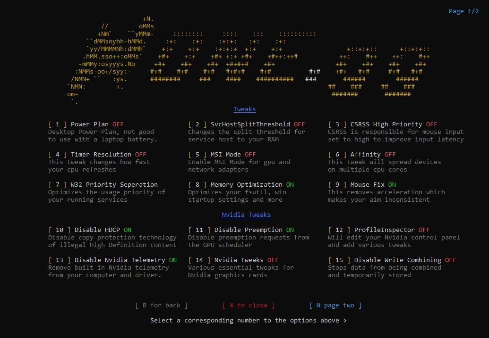
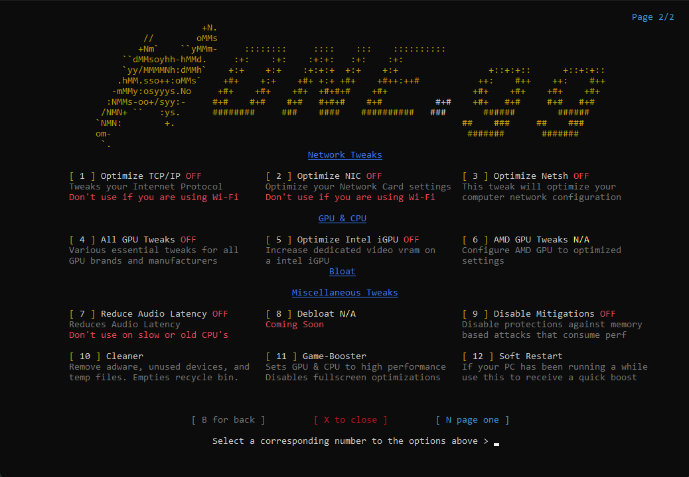
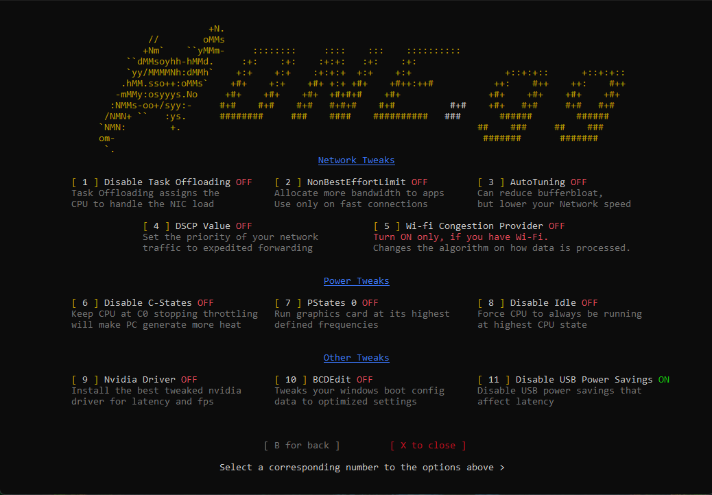

# **An in-depth guide on optimizations for Windows**

	 
	

		
	

	 
	

		
		
        
    

[**Guide Version & Date last updated**](/render/version.md)

[**Winver**](/render/winver.md)

 [**Latest Windows 10 Winver**](https://learn.microsoft.com/en-us/windows/release-health/release-information) | [**Latest Windows 11 Winver**](https://learn.microsoft.com/en-us/windows/release-health/windows11-release-information)

**Note:** This guide/collection is for windows 10 64-bit and 11 64-bit. If you are using windows 7 or 8, you can use this guide but some of the steps may not work. It is advised to make a backup of your computer before doing any of the steps in this guide. Here is a guide on how to **[create a system restore point](https://support.microsoft.com/en-us/windows/create-a-system-restore-point-77e02e2a-3298-c869-9974-ef5658ea3be9)**. If you feel like anything is missing or needs to be changed, feel free to make a pull request or open an issue.

**Disclaimer:** I am not responsible for any damage done to your computer. This guide is for educational purposes only.

> This guide is essentially a collection of tweaks and information. Some are by others, some are by me. If you want to use this guide, please link to this github.

### **Table of Contents**

- [**General Tweaks**](#general-tweaks)
- [**Service Tweaks**](#service-tweaks)
- [**Gaming Tweaks**](#gaming-tweaks)
- [**Network Tweaks**](#network-tweaks)
	- [**Cloudflare IPv4 DNS Servers**](#cloudflare-ipv4-dns-servers)
	- [**Cloudflare IPv6 DNS Servers**](#cloudflare-ipv6-dns-servers)
	- [**Google IPv4 DNS Servers**](#google-ipv4-dns-servers)
	- [**Google IPv6 DNS Servers**](#google-ipv6-dns-servers)
	- [**Quad9 IPv4 DNS Servers**](#quad9-ipv4-dns-servers)
	- [**Quad9 IPv6 DNS Servers**](#quad9-ipv6-dns-servers)
	- [**Good to know IPConfig commands**](#good-to-know-ipconfig-commands)
	- [**Generally good to know know commands**](#generally-good-to-know-commands)
	- [**Bandwidth Measurement**](#bandwidth-measurement)
- [**Optional Tweaks**](#optional-tweaks)
- [**NVIDIA Tweaks**](#nvidia-tweaks)
- [**AMD & Intel CPU Tweaks**](#amd--intel-cpu-tweaks)
- [**Visual Tweaks**](#visual-tweaks)
- [**BIOS Tweaks**](#bios-tweaks)
    - [**Intel CPU**](#for-those-who-are-using-an-intel-cpu-you-can-disable-the-following)
	- [**AMD CPU**](#for-those-who-are-using-a-amd-cpu-you-can-disable-the-following)
	- [**NVIDIA GPU**](#for-those-who-are-using-an-nvidia-gpu-you-can-do-the-following)
	- [**Intel GPU**](#for-those-who-are-using-an-intel-gpu-you-can-do-the-following)
	- [**AMD GPU & AMD CPU**](#for-those-who-are-using-an-amd-gpu--an-amd-cpu-you-can-do-the-following)
	- [**Miscellaneous BIOS Tweaks**](#miscellaneous-bios-tweaks)
	- [**Memory Tweaks**](#memory-tweaks)
- [**Driver Tweaks**](#driver-tweaks)
	- [**Debloat NVIDIA Drivers**](#debloat-nvidia-drivers)
- [**Programming Tools**](#programming-tools)
- [**Gaming Configs**](#gaming-configs)
	- [**My Process Lasso Configuration**](#my-process-lasso-configuration)
	- [**My Powerplan**](#my-powerplan)
- [**Safe to use HoneCTRL settings for NVIDIA**](#safe-to-use-honectrl-settings-for-nvidia)
- [**Useful Links/Downloads**](#useful-linksdownloads)
- [**Dive deeper into optimization**](#dive-deeper-into-optimization)
- [**Credits**](#credits)

### **General Tweaks**

---

- Uninstall all unnecessary apps by using `appwiz.cpl` in Run (WIN + R).

- Make sure that you have the latest version of windows. As of current date it would be [**Windows 10**](https://learn.microsoft.com/en-us/windows/release-health/release-information) | [**Windows 11**](https://learn.microsoft.com/en-us/windows/release-health/windows11-release-information). 

- Download this application => **[https://github.com/hellzerg/optimizer/releases](https://github.com/hellzerg/optimizer/releases)** and continue following the guide.

> For example, if you would like to keep print service on then wouldn't tick "Disable Print Service".

- Disable all the unnecessary startup apps. To do this you want to go and open up Task Manager. Go to the Startup tab and disable all the apps that you do not use.

- To complete this process you may need to go into regedit and the delete some startup keys from there, or you could use **[https://github.com/hellzerg/optimizer/releases](https://github.com/hellzerg/optimizer/releases)** and simply go to the Startup tab and select all the apps that you do not use and delete them.

- Select the Startup tab.

- Select all the apps that you do not use.

- Click delete.

- When you recieve the popup to delete all the selected startup items click yes. This deletes all the registry keys for the startup apps that you do not use.
 
 

 

- Run Windows Disk Cleanup. WIN + R and type `cleanmgr.exe`, then press enter. Choose your drive and press **OK**. Then select what you would like to clean up and hit **OK**.

- Run Windows Defragment and trimmer. WIN + R and type `dfrgui.exe`, then press enter. Select your drive and press Optimize or Analyze.

- Change energy plan. Open control panel and search for power plan. Then select **show additional plans** and select **Ultimate Performance**. 

- Run SystemPropertiesAdvanced in WIN + R. Then hit settings for performance. Then select **Adjust for best performance**.

- If you have external drives open up SystemPropertiesAdvanced and go to settings for Performance. Then go to advanced and under virtual memory select **No paging file**. This will disable the paging file on your external drives. **Do not do this on your main drive.**

- Enable everything in System > Monitor > Graphics Settings > Default Graphics Settings. This will make your computer run smoother.

- Disable Storage Sense.

- WIN + R and type `msconfig`. Then go to the Services tab and disable all the services that you do not use. Then go to the Boot tab and open up advanced options for your boot drive. Go back to the Boot tab and change your timeout to 5 seconds for a mid-high end computer. 10 seconds for a low-mid end computer. And 20 seconds for a laptop. **Do not change anything else in there**.

- Open an elevated command prompt and type `bcdedit /set increaseuserva 3072` and press enter. This will increase the amount of virtual memory that your computer can use. This will help with performance and crashes if you have a 32 bit system. **Do not do this on a 64 bit system.**

> Open an elevated command prompt and type `slmgr /ipk W269N-WFGWX-YVC9B-4J6C9-T83GX`. Then set a KMS server by typing `slmgr /skms kms8.msguides.com`. Then activate windows by typing `slmgr /ato`. This will activate windows and make it enable all the features and remove the ugly watermark. Run `slmgr /xpr` to check if it worked.

### **Service Tweaks**

---

**Disclaimers for this section specifically:** Do not, and I repeat do NOT disable any service that you don't know what it does. If you do not know what a service does, then google it. If you disable a service that is required for your computer to run, unexpected errors might popup. I am not responsible for any damage done to your computer. This guide is for educational purposes only.

1. To begin with this section, you have to open up services.msc. To do this you can either WIN + R and type "services.msc" or you can open up task manager and go to the services tab and click on "Open Services" at the bottom of the window. Or by simply searching for services in the start menu.

2. Identify the unnecessary services: Look through the list of services and identify those that you don't need. You can use google to identify services that's unnecessary and that can be safely disabled.

3. Disable unnecessary services, to disable a service, right-click on it and select "Properties". In the "Startup type" drop-down menu, select "Disabled". Click "Apply" and then "OK" to save your changes. Repeat this step for any other unnecessary services.

4. Restart your computer: Once you've made changes to the services, it's a good idea to restart your computer to ensure that the changes take effect instantly.

> Optimizing Windows services can help improve your computer's performance by reducing unnecessary resource usage and delta cycles. However, it's important to be extra careful when disabling services, as some services are required for important things. If you disable a service that's required for your computer to run, unexpected errors might popup. So, make sure to only disable services that you don't need.

### **Gaming Tweaks**

---

- Disable hardware acceleration on everything, your browser, discord etc. This will increase performance by a lot. 

- Disable all ingame overlays. This will increase performance by a lot.

- **[Process Lasso](https://bitsum.com/)** is an advanced process priority optimization and system automation utility.

- **[https://www.msi.com/Landing/afterburner/graphics-cards](https://www.msi.com/Landing/afterburner/graphics-cards)** is a graphics card overclocking utility.

- **[https://www.guru3d.com/files-details/display-driver-uninstaller-download.html](https://www.guru3d.com/files-details/-display-driver-uninstaller-download.html)** is a display driver uninstaller which you can bundle up with NVCleanstall to debloat your graphics card drivers **[https://www.techpowerup.com/nvcleanstall/](https://www.techpowerup.com/nvcleanstall/)**.

- **[https://www.techpowerup.com/download/techpowerup-gpu-z/](https://www.techpowerup.com/download/techpowerup-gpu-z/)** is a graphics - card information utility.

- **[https://www.techpowerup.com/download/cpu-z/](https://www.techpowerup.com/download/cpu-z/) or [https://www.cpuid.com/softwares/cpu-z.html](https://www.cpuid.com/softwares/cpu-z.html)**  is a freeware that gathers information on some of the main devices of your system.

### **Network Tweaks**

---

#### **Cloudflare IPv4 DNS Servers**

1.1.1.1 and 1.0.0.1

#### **Cloudflare IPv6 DNS Servers**

2606:4700::1111 and 2606:4700:4700::1001

#### **Google IPv4 DNS Servers**

 8.8.8.8 and 8.8.4.4
 
#### **Google IPv6 DNS Servers**

2001:4860:4860::8888 and 2001:4860:4860::8844

#### **Quad9 IPv4 DNS Servers**

9.9.9.9 and 149.112.112.112

#### **Quad9 IPv6 DNS Servers**

2620:fe::fe and 2620:fe::9

#### **Good to know IPConfig commands**

`ipconfig /flushdns` - Flushes the DNS cache.

`ipconfig /Displaydns` - Shows information about your current DNS server.

`ipconfig /Registerdns` - Initiates manual dynamic registration for the DNS names and IP addresses that are configured at a computer.

`ipconfig /release` - Releases the IPv4 address that you are currently using.

`ipconfig /release6` - Releases the IPv6 address that you are currently using.

`ipconfig /renew` - Renews an IPv4 address on your device.

`ipconfig /renew6` - Renews an IPv6 address on your device.

`ipconfig /all` - Displays all the information about all your current network adapters.

`ipconfig /?` - Help for IPConfig.

#### **Generally good to know commands**

`netsh => /?` -  A powerful command for configuring network adapters.

`netstat` - Displaying Network Statistics.

`net` - View different parts of your network.

`nslookup` - Useful for diagnosing DNS name resolution problems.

`hostname` -  Identify your current hostname.

`arp` - Modify & Display the Address Resolution Protocol cache.

`getmac` - Displays your current MAC address.

`systeminfo` - Information about your device.

`pathping` - Combines Ping & Tracert.

`tracert` - Trace packets to a destination.

#### **Bandwidth Measurement**

**Mb** - Megabit

**MB** - Megabyte

**Mbps** - Megabit per second.

**MBps** - Megabyte per second.

**b** - bit

**B** - byte

**https://1.1.1.1/**

**https://developers.google.com/speed/public-dns/docs/using**

**https://www.quad9.net/service/service-addresses-and-features**

**https://learn.microsoft.com/en-us/windows-server/administration/windows-commands/ipconfig**

### **Optional Tweaks**

---

- WPD is a privacy tool **[https://wpd.app/](https://wpd.app/)**. It is a free and open source tool that allows you to disable telemetry and other privacy invasive features in Windows 10 and 11. It is recommended to use this tool if you are concerned about your privacy.

- **[https://www.bleachbit.org/](https://www.bleachbit.org/)** is a disk cleaner for windows. **Recommended**

- **[https://www.oo-software.com/en/shutup10/update](https://www.oo-software.com/en/shutup10/update)** an antispy tool for windows 10 and 11.

- **[https://www.speedguide.net/downloads.php](https://www.speedguide.net/downloads.php)**. This is a tool that will help you optimize your internet connection. It's called TCP Optimizer. You would want to download version 4.0.14. It's the latest version.

- **[https://github.com/auraside/HoneCtrl](https://github.com/auraside/HoneCtrl)** a windows bat script. Aimed to optimize your computer for general use and gaming. 

- A windows tool that allows you to achive maximum productivity **[https://github.com/microsoft/PowerToys](https://github.com/microsoft/PowerToys)**. **Recommended**

- **[https://www.malwarebytes.com/solutions/rootkit-scanner](https://www.malwarebytes.com/solutions/rootkit-scanner)** a rootkit scanner. **Recommended**

- **[https://www.malwarebytes.com/solutions/malware-scanner](https://www.malwarebytes.com/solutions/malware-scanner)** a malware scanner. **Recommended**

- **[https://github.com/builtbybel/ThisIsWin11](https://github.com/builtbybel/ThisIsWin11)** a windows 11 tweaker, only available for windows 11. **Recommended**

### **NVIDIA Tweaks**

--- 

- Disable NVIDIA Adaptive V-Sync. This will disable the GPU from using Adaptive V-Sync. This will increase performance.

- Disable NVIDIA Ansel. This will disable the GPU from using Ansel. This will increase performance.

- Disable NVIDIA Ambient Occlusion. This will disable the GPU from using Ambient Occlusion. This will increase performance.

- Disable NVIDIA Shadowplay. This will disable the GPU from using Shadowplay. This will increase performance.

### **AMD & Intel CPU Tweaks** 

---
 
- Disable Intel Hyper-Threading/SMT using Process Lasso. This will disable the CPU from using Hyper-Threading/SMT. This will increase performance in some CPU bound applications/games.

### **Visual Addons** 	

---

- **MicaForEveryone** -  A tool that allows for customization of Win32 apps. **[https://github.com/MicaForEveryone/MicaForEveryone](https://github.com/MicaForEveryone/MicaForEveryone)** **Only Available for Windows 11** |  [**My MicaForEveryone config**](/configurations/MicaForEveryone.conf). 

- **StartAllBack** - **[https://www.startallback.com/](https://www.startallback.com/)** a tool that allows you to change the start menu. **Only Available for Windows 11** | [**My StartAllBack config**](/configurations/StartAllBack.conf).

- **StartAllBack** - **[https://startisback.com/](https://startisback.com/)** a tool that allows you to change the start menu. **Only Available for Windows 10**

### **BIOS Tweaks**

---
**Note: Only disable those that you do not need! If you disable something that you need, something might break.**

### **For those who are using an Intel CPU, you can do the following**

- Disable Intel SpeedStep. This will disable the CPU from going into a low power state. This will increase performance.
- Disable Intel VT-d. This will disable the CPU from using an old Virtualization technology and improve security when using a VM in some cases. This will increase performance.

### **For those who are using a AMD CPU, you can do the following**

- Disable AMD Cool'n'Quiet. This will disable the CPU from going into a low power state. This will increase performance.
- Disable AMD C1E. This will disable the CPU from going into a low power state. This will increase performance.

### **For those who are using an NVIDIA GPU, you can do the following**

- Enable/Disable Resizable bar. This will enable the GPU from using Resizable bar. This will increase performance. **Only Available for the 30 series and up**

### **For those who are using an Intel GPU, you can do the following**

- Enable/Disable Resizable bar. This will enable the GPU from using Resizable bar. This will increase performance. 

- Enable Above 4G Decoding. It's needed for the GPU to use Resizable bar. This will increase performance in some specific cases.

### **For those who are using an AMD GPU & an AMD CPU, you can do the following**

- Enable SAM. "In conventional Windows-based PC systems, processors can only access a fraction of graphics memory (VRAM) at once, limiting system performance.
With AMD Smart Access Memory, the data channel gets expanded to harness the full potential of GPU memory, utilizing the bandwidth of PCI Express® to remove the bottlenecks and increase performance." - [**AMD**](https://www.amd.com/en/technologies/smart-access-memory). **Only do it if you meet the following requirements**.

### **Miscellaneous BIOS Tweaks**

- Enable XMP or DOCP or EXPO. This will enable the RAM to run at a higher speed. This will increase performance.
- Enable UEFI. This will enable your system to run at 64-bit speed and support TPM. This could increase performance.

### **Memory Tweaks**

- Memory optimizations for ASUS motherboards **[https://www.asus.com/us/support/FAQ/1042256](https://www.asus.com/us/support/FAQ/1042256)**.

- Memory optimizations for MSI motherboards **[https://www.msi.com/blog/memory-force](https://www.msi.com/blog/memory-force)**.

### **Driver Tweaks**

---

- If you have intel hardware you can install the intel driver and support assistant. This will allow you to update your drivers. **[https://www.intel.com/content/www/us/en/support/detect.html](https://www.intel.com/content/www/us/en/support/detect.html)**. Only works with Intel hardware. **Recommended**

- If you have AMD hardware you can install the AMD driver and support assistant. This will allow you to update your drivers. **[https://www.amd.com/en/support](https://www.amd.com/en/support)**. Only works with AMD hardware. **Recommended**

- If you have Nvidia hardware you can install the Nvidia drivers and geforce experience. This will allow you to update your drivers. **[https://www.nvidia.com/en-us/drivers](https://www.nvidia.com/en-us/drivers)**. Only works with Nvidia hardware. **Recommended**

### **Debloat NVIDIA Drivers**

-  Download **[DDU](https://www.guru3d.com/files-details/display-driver-uninstaller-download.html)**.

-  Download **[NVCleanstall](https://www.techpowerup.com/nvcleanstall/)**.

-  Boot into safe mode.

- Run DDU and uninstall the drivers.

- **Reboot.**

- Run NVCleanStall and build the driver using these settings - This step is optional, the latest debloated drivers can be found here: **[LukeHjo_531.79.exe](/drivers/LukeHjo_531.79.exe)**.

	</a>

- Install the drivers from the package that NVcleanstall created.

- **Reboot.**

### **Programming Tools**
 
---

- Chocolatey is a package manager for windows. It allows you to install programs from the command line. **[https://chocolatey.org/install](https://chocolatey.org/install)**. **Recommended**

- Scoop is a package manager for windows. It allows you to install programs from the command line. **[https://scoop.sh/](https://scoop.sh/)**. **Recommended**

### **Debugging Tools**

### **Gaming Configs**

---

- An NVIDIA Config. **[https://drive.google.com/drive/folders/16mqXNV5ToHmhZIO5R8RfnD9YhVZ5Ueix?usp=share_link](https://drive.google.com/drive/folders/16mqXNV5ToHmhZIO5R8RfnD9YhVZ5Ueix?usp=share_link)**. 

- A config for Modern Warfare 2 & Warzone 2. **[https://drive.google.com/drive/folders/1n-g10GF6DOOOBxRMTeDA31wT2pQIMozF?usp=share_link](https://drive.google.com/drive/folders/1n-g10GF6DOOOBxRMTeDA31wT2pQIMozF?usp=share_link)**. 

- A config for Apex Legends. **[https://drive.google.com/drive/u/2/folders/1KvuaFTN4XeMtVdv1FwknZhE9L0Ac1aNz](https://drive.google.com/drive/u/2/folders/1KvuaFTN4XeMtVdv1FwknZhE9L0Ac1aNz)**.

- A config for Destiny 2 **[https://drive.google.com/drive/folders/1luSpEJRd5lpyaVkgxMroVl4p4-jOO2zZ?usp=share_link](https://drive.google.com/drive/folders/1luSpEJRd5lpyaVkgxMroVl4p4-jOO2zZ?usp=share_link)**.

- A config for The Last Of Us Part 1 **[https://drive.google.com/drive/folders/1_MCWZXv9EOfIi6f_f4qJ_qFi52Sj9wcN?usp=share_link](https://drive.google.com/drive/folders/1_MCWZXv9EOfIi6f_f4qJ_qFi52Sj9wcN?usp=share_link)**.

- A config for Battlefield 2042 **[https://drive.google.com/drive/folders/1sBJ3xZnZRAbON-auM0TaWSIIVrFgdwuy?usp=share_link](https://drive.google.com/drive/folders/1sBJ3xZnZRAbON-auM0TaWSIIVrFgdwuy?usp=share_link)**.

- A config for Elden Ring **[https://drive.google.com/drive/folders/1uNCmr3_UttUiv9mSlMig47kJy5k_55KK?usp=share_link](https://drive.google.com/drive/folders/1uNCmr3_UttUiv9mSlMig47kJy5k_55KK?usp=share_link)**.

- A config for Apex Legends (DX11 & DX12) **[https://drive.google.com/drive/u/2/folders/1KvuaFTN4XeMtVdv1FwknZhE9L0Ac1aNz](https://drive.google.com/drive/u/2/folders/1KvuaFTN4XeMtVdv1FwknZhE9L0Ac1aNz)**.

- A config for Halo Infinite **[https://drive.google.com/drive/folders/1KxkTIaptRysTj3cSkKDf5OAh1v58fxe3?usp=share_link](https://drive.google.com/drive/folders/1KxkTIaptRysTj3cSkKDf5OAh1v58fxe3?usp=share_link)**.

- A config for Shatterline **[https://drive.google.com/drive/folders/1dK9_n8d23-LqYlOUMG5sXbDNNdvcdAWB?usp=share_link](https://drive.google.com/drive/folders/1dK9_n8d23-LqYlOUMG5sXbDNNdvcdAWB?usp=share_link)**.

- A config for Valorant **[https://drive.google.com/drive/folders/11EkV5vZnaA4JArvVrD6PnyVcYA5OkUhX?usp=share_link](https://drive.google.com/drive/folders/11EkV5vZnaA4JArvVrD6PnyVcYA5OkUhX?usp=share_link)**.

- A config for Fortnite **[https://drive.google.com/drive/folders/1zYUWd3FQ5fBkaEse-3uCh1JpY_afq-uD?usp=share_link](https://drive.google.com/drive/folders/1zYUWd3FQ5fBkaEse-3uCh1JpY_afq-uD?usp=share_link)**.

- A config for CS: GO **[https://drive.google.com/drive/folders/1Z1M2krDzhzyGwkJoC1kDJVvj_BtJkRS-?usp=sharing](https://drive.google.com/drive/folders/1Z1M2krDzhzyGwkJoC1kDJVvj_BtJkRS-?usp=sharing)**.

### **My Process Lasso configuration**
- **Process Lasso** is a software that allows you to control the processes running on your computer. It can be used to set priorities for certain programs, limit the number of cores they use, and more. My configuration is adapted to fit any system. My configuration file can be downloaded here: [Process Lasso Configuration](https://raw.githubusercontent.com/luke-beep/guide-to-optimizing-windows/main/configurations/ProcessLasso_LukeHjo2611.INI). To import this profile you'd have to follow these 4 simple steps:
> 1. Open Process Lasso
> 2. Click on the "File" tab
> 3. Click on "Import Configuration"
> 4. Select the configuration file you downloaded

### **My Powerplan**
- **Powerplan** is a built in feature that allows you to control the power settings of your computer. It can be used to set the power plan to high performance, balanced, power saver or a custom one. My configuration is adapted to fit any system and most of it is taken from the already great Bitsum powerplan. My configuration file can be downloaded here: [Powerplan Configuration](https://raw.githubusercontent.com/luke-beep/guide-to-optimizing-windows/main/configurations/Powerplan_LukeHjo2611.pow). To import this profile you'd have to follow these 4 simple steps:
> 1. Open CMD with elevated privileges.
> 2. Type in `powercfg -import "C:\Users\%USERNAME%\Desktop\Powerplan_LukeHjo2611.pow"`
> 3. Press enter
> 4. Open the powerplan settings and select the imported powerplan or type in `powercfg -list` and then `powercfg -setactive <GUID>` where `<GUID>` is the GUID of the powerplan you want to use.

### **Safe to use HoneCTRL settings for NVIDIA**
----

 > **HoneCTRL** is a software designed for tweaking and optimizing your computer's performance. It allows you to adjust various system settings, such as CPU and RAM usage, power management, and network configurations, to get the most out of your computer's hardware. However, it is important to be cautious when using **HoneCTRL** and similar tweaking software, as making the wrong changes can cause serious problems and even damage your system. It's always a good idea to set a restore point before making any adjustments, so you can easily revert to a stable version if something goes wrong.

- **Optimizations Page 1**
> 

- **Optimizations Page 2**
> 

- **Advanced Tab**
> 

### **Useful Links/Downloads**

---

- The Author of this guide can be found here **[https://github.com/luke-beep](https://github.com/luke-beep)**.

- "Another guide to TCP Optimizer can be found here" - Speedguide **[https://www.speedguide.net/faq/35-what-are-the-best-tcp-optimizer-settings-for-474](https://www.speedguide.net/faq/35-what-are-the-best-tcp-optimizer-settings-for-474)**.

- Display Driver Uninstaller also known as DDU Guide can be found here **[https://www.wagnardsoft.com/content/DDU-Guide-Tutorial](https://www.wagnardsoft.com/content/DDU-Guide-Tutorial)**.

- An unofficial guide for MSI Afterburner can be found at **[https://www.youtube.com/watch?v=qiKXUG64neA](https://www.youtube.com/watch?v=qiKXUG64neA)**.

- "True nature of E-cores and how effective are they?" - Techpowerup **[https://www.techpowerup.com/forums/threads/true-nature-of-e-cores-and-how-effective-are-they.298321/](https://www.techpowerup.com/forums/threads/true-nature-of-e-cores-and-how-effective-are-they.298321/)**.

- "NVIDIA GeForce Graphics Drivers" - Techpowerup **[https://www.techpowerup.com/download/nvidia-geforce-graphics-drivers/#history](https://www.techpowerup.com/download/nvidia-geforce-graphics-drivers/#history)**.

- "AMD Radeon Graphics Drivers" - Techpowerup **[https://www.techpowerup.com/download/amd-radeon-graphics-drivers/](https://www.techpowerup.com/download/amd-radeon-graphics-drivers/)**.

- "Intel ARC Graphics Drivers" - Techpowerup **[https://www.techpowerup.com/download/intel-arc-graphics-drivers/](https://www.techpowerup.com/download/intel-arc-graphics-drivers/)**.

- "Intel iGPU Graphics Drivers" - Techpowerup **[https://www.techpowerup.com/download/intel-integrated-graphics-drivers/](https://www.techpowerup.com/download/intel-integrated-graphics-drivers/)**.

- My Mica For Everyone configuration **[MicaForEveryone.conf](/configurations/MicaForEveryone.conf)**.

- "What Is Resizable BAR and How Do I Enable It?" - Intel [**https://www.intel.com/content/www/us/en/support/articles/000090831/graphics.html**](https://www.intel.com/content/www/us/en/support/articles/000090831/graphics.html).

- "AMD Smart Access Memory" - AMD [**https://www.amd.com/en/technologies/smart-access-memory**](https://www.amd.com/en/technologies/smart-access-memory)

- "GeForce RTX 30 Series Performance Accelerates With Resizable BAR Support" - NVIDIA [**https://www.nvidia.com/en-us/geforce/news/geforce-rtx-30-series-resizable-bar-support/**](https://www.nvidia.com/en-us/geforce/news/geforce-rtx-30-series-resizable-bar-support/)

- "NVIDIA Resizable BAR Firmware Update Tool" - NVIDIA [**https://nvidia.custhelp.com/app/answers/detail/a_id/5165/~/nvidia-resizable-bar-firmware-update-tool**](https://nvidia.custhelp.com/app/answers/detail/a_id/5165/~/nvidia-resizable-bar-firmware-update-tool)

- "Thermal Design Power (TDP) in Intel® Processors" - Intel [**https://www.intel.com/content/www/us/en/support/articles/000055611/processors.html**](https://www.intel.com/content/www/us/en/support/articles/000055611/processors.html)

- "Process count doesnt matter" - Zusier [**https://zusier.xyz/blog/posts/process-count-doesnt-matter/**](https://zusier.xyz/blog/posts/process-count-doesnt-matter/)

- "DDR4 OC Guide" - Integralfx [**https://github.com/integralfx/MemTestHelper/blob/oc-guide/DDR4%20OC%20Guide.md**](https://github.com/integralfx/MemTestHelper/blob/oc-guide/DDR4%20OC%20Guide.md)

### Dive deeper into optimization

---

- "PC-Tuning" - Amit **[https://github.com/amitxv/PC-Tuning/tree/main](https://github.com/amitxv/PC-Tuning/tree/main)**

- "GamingPCSetup" - DJDallmann **[https://github.com/djdallmann/GamingPCSetup](https://github.com/djdallmann/GamingPCSetup)**

- "Calypto's Latency Guide" - Calypto **[https://docs.google.com/document/d/1c2-lUJq74wuYK1WrA_bIvgb89dUN0sj8-hO3vqmrau4/edit](https://docs.google.com/document/d/1c2-lUJq74wuYK1WrA_bIvgb89dUN0sj8-hO3vqmrau4/edit)**.

- My Tech Blog can be found here **[https://dev.lukehjo.tech/](https://dev.lukehjo.tech/)**.

- My forum can be found here **[https://forum.lukehjo.tech/](https://forum.lukehjo.tech/)**.

### Credits

---

- **nikø#7787**

- **xetanyl#7777**

- [**Auraside**](https://github.com/auraside)

- [**Hellzerg**](https://github.com/hellzerg)

- [**TheSoapTech**](https://www.tiktok.com/@thesoaptech)

---

**
 Contact me at lukehjo@gmail.com | © 2023 LukeHjo. All rights reserved. 
**
 

<a href="#">(Back to top)</a>

