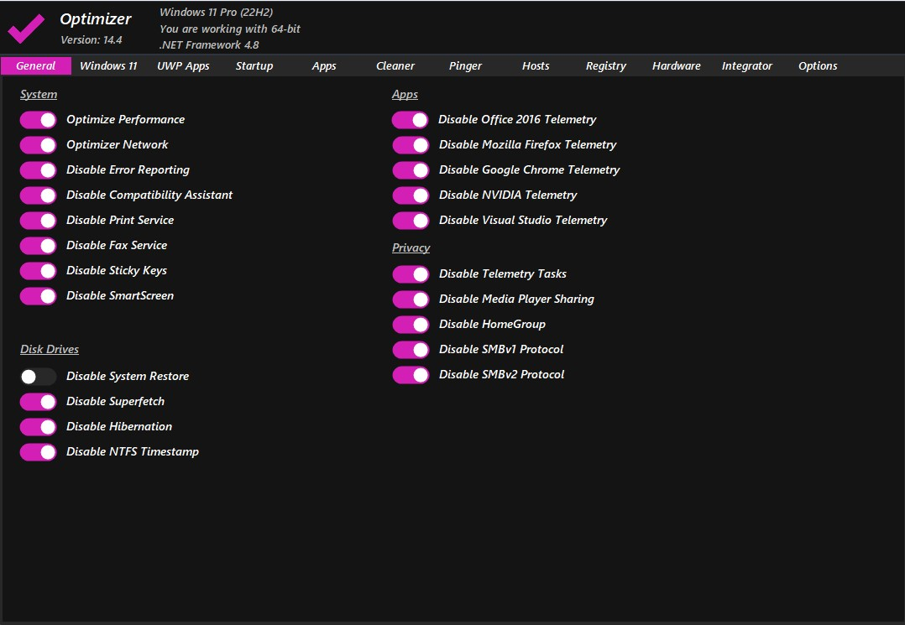
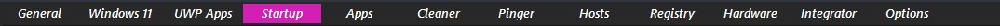
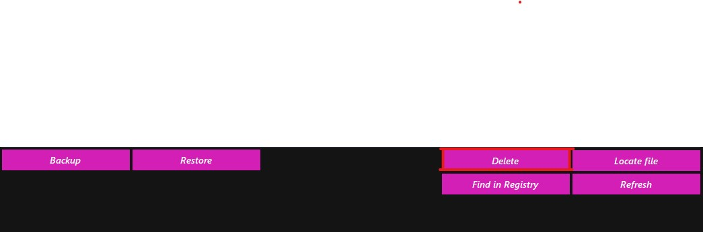

# guide-to-optimizing-windows
A guide to optimize windows version 10 and 11.

Date last updated: 12 November 2022

1. Uninstall all unnecessary apps.

2. Make sure that you have the latest version of windows. As of current date it would be 22H2. 

3. Download this program [https://github.com/hellzerg/optimizer/releases](https://github.com/hellzerg/optimizer/releases) and follow the next few steps.

For example, if you would like to keep print service on then you do not tick "Disable Print Service".

4. Disable all the unnecessary startup apps. To do this you want to go and open up Task Manager. Go to the Startup tab and disable all the apps that you do not use.

5. To complete this process you may need to go into regedit and the delete some startup keys from there, or you could use [https://github.com/hellzerg/optimizer/releases](https://github.com/hellzerg/optimizer/releases) and simply go to the Startup tab and select all the apps that you do not use and delete them.

1. Download the latest release of Optimizer ~> [https://github.com/hellzerg/optimizer/releases](https://github.com/hellzerg/optimizer/releases)
2. Apply most settings relevant to you **EXCEPT** the following configuration items:

        DisableMediaPlayerSharing  
        BlockSkypeAds
        DisableAutomaticUpdates
        DisableSilentAppInstall		
        ExcludeDrivers
	

3. Download the latest SpeedGuide TCP Optimizer ~> [https://www.speedguide.net/downloads.php](https://www.speedguide.net/downloads.php)
4. Follow this guide for TCP Optimizer ~> [https://www.speedguide.net/faq/35-what-are-the-best-tcp-optimizer-settings-for-474](https://www.speedguide.net/faq/35-what-are-the-best-tcp-optimizer-settings-for-474)
5. For additional network settings follow this guide ~> [https://github.com/CHEF-KOCH/GamingTweaks/tree/master/Network](https://github.com/CHEF-KOCH/GamingTweaks/tree/master/Network)

	**Do not disable *Checksum Offload* - ignore guide**
	
6. Follow this guide for SSD optimizations ~> [https://github.com/CHEF-KOCH/GamingTweaks/blob/master/SSD/SSD%20-%20Readme.md](https://github.com/CHEF-KOCH/GamingTweaks/blob/master/SSD/SSD%20-%20Readme.md)
7. Verify Router optimizations are set by following this guide (*scroll to section Router Settings*) ~> [https://www.speedguide.net/articles/gaming-tweaks-5812](https://www.speedguide.net/articles/gaming-tweaks-5812)

*Highly recommend running a custom firmware for performance and security reasons.*
	
ASUS Routers ~> [https://www.asuswrt-merlin.net/](https://www.asuswrt-merlin.net/)

NETGEAR Routers ~> [https://www.voxel-firmware.com/](https://www.voxel-firmware.com/)

*If you know what you are doing or want to test other optimizations you can follow these guides ~> [https://github.com/CHEF-KOCH/GamingTweaks](https://github.com/CHEF-KOCH/GamingTweaks)*

**Do not forget to tweak your GPU settings!**

**Recommended Tools:**
 1. Disk Cleaner ~> [https://www.bleachbit.org/](https://www.bleachbit.org/)
 2. Windows Disk Cleanup
 3. Windows  Defragment and Optimize Drives
 4. Sidebar Diagnostics for GPU, CPU, Network and Disk ~> [https://github.com/ArcadeRenegade/SidebarDiagnostics/releases](https://github.com/ArcadeRenegade/SidebarDiagnostics/releases)
 5. Atomic Clock Sync (Sync every 20 minutes) ~> [https://www.worldtimeserver.com/atomic-clock/](https://www.worldtimeserver.com/atomic-clock/)

**Opitional Tweak:**

*Blocking ad, malware, adware and tracking server hostnames*

 1. Download hosts file ~> [https://raw.githubusercontent.com/StevenBlack/hosts/master/hosts](https://raw.githubusercontent.com/StevenBlack/hosts/master/hosts)
 2. Move or overwrite the file with the newly downloaded hosts file:
 	
	**%SystemRoot%\system32\drivers\etc\hosts**

Read more here ~> [https://github.com/StevenBlack/hosts](https://github.com/StevenBlack/hosts)
