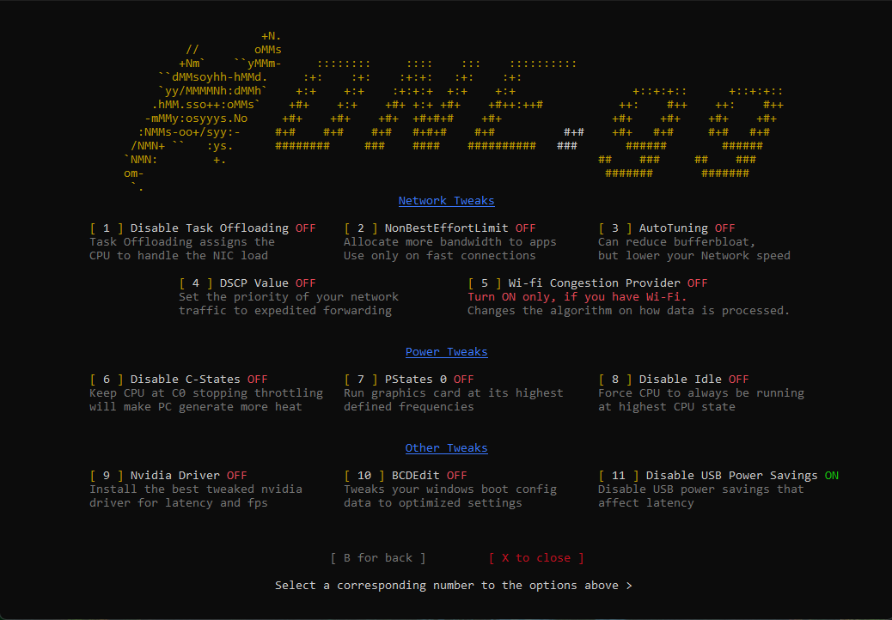

# **HoneCTRL** can be downloaded from the [official repository](https://github.com/auraside/HoneCtrl).

> **HoneCTRL** is a software designed for tweaking and optimizing your computer's performance. It allows you to adjust various system settings, such as CPU and RAM usage, power management, and network configurations, to get the most out of your computer's hardware. However, it is important to be cautious when using **HoneCTRL** and similar tweaking software, as making the wrong changes can cause serious problems and even damage your system. It's always a good idea to set a restore point before making any adjustments, so you can easily revert to a stable version if something goes wrong.

- **Optimizations Page 1**
> 

- **Optimizations Page 2**
> 

- **Advanced Tab**
> 

### **Settings Explained**

--- 

### **Optimizations Page 1**

- Power Plan
    - Don't enable this if you have a laptop. [Hone power plan](/configurations/Hone/HoneV2.pow) will enable Processor idle disable power setting. This will disable the CPU from going into idle state. This will increase performance but will also increase power consumption and heat. All of the power plan settings can be found [here](https://bitsum.com/known-windows-power-guids/). If you want to view your own power plan settings you can do so by running `powercfg /Q` in command prompt.
- SvcHostSplitThreshold
    - This setting will split the SvcHost process into multiple processes. This will increase transparency by allowing you to view every single service individually. It'll allow you to fix any issues with a specific service. 
- CSRSS High Priority
    - As mentioned in the name, this will set the CSRSS process to high priority. This will could potentially increase performance but could increase latency as well. It's best to benchmark this setting to see if it's worth it.
- Timer Resolution 
    - This will set the timer resolution to 0.5ms using the [SetTimerResolutionService](/Applications/SetTimerResolutionService.exe) service. It is the same as running the normal Timer Resolution application but this one will run as a service. 
- MSI Mode
    - Enables MSI Support for all of the supported PnP devices. 
- Affinity
    - Spreads your devices amongst different cores as the description indicates. You'd need a CPU with more than 4 cores for this setting to work. To shorten it down, it essentially spreads your devices (USB Controllers, Network Adapters, Video Controller, ) amongst different cores.
- W32 Priority Seperation
    - Sets the W32 Priority seperation to either 38 or 40 depending on your selection. Further information can be found [here](https://github.com/amitxv/PC-Tuning/blob/main/docs/research.md).
- Memory Optimization
    - Disables [FTH](https://learn.microsoft.com/en-us/windows/win32/win7appqual/fault-tolerant-heap), Disables Desktop Composition and Background Apps. Also prevents drivers from being able to get paged into virtual memory. Disables Page Combining & Memory Compression. Enables a bigger system cache to improve micro stuttters. Also disables [Superfetch](https://www.howtogeek.com/811043/disable-superfetch/) , and prefetch. Additionally, it does a lot of modifications using fsutil [Raised Paged Memory Pool, Optimizing the MFT Zone, Disables Last Access which enchances privacy, Disables Virtual Memory Pagefile Encryption, Disables file compression on certain file systems, enables trim, disables a technology called ReFS v2, sets the NTFS quota to 5400 instead of the default], alongside that it also increases the icon cache size.
- Mouse Fix
    - Automated version of [The MarkC Windows 10 + 8.1 + 8 + 7 Mouse Acceleration Fix
](https://donewmouseaccel.blogspot.com/2010/03/markc-windows-7-mouse-acceleration-fix.html).
- Disable HDCP
    - As the description indicates, this will disable [HDCP](https://forums.guru3d.com/threads/disable-hdcp-regedit.442563/). This will prevent you from viewing HDCP content.
- Disable Preemption
    - This setting can cause DWM to be delayed, which is the reason for glitches in certain Windows animations. [Further Reading](https://learn.microsoft.com/en-us/windows-hardware/drivers/display/gpu-preemption).
- ProfileInspector
    - This will import a custom NVIDIA Profile inspector profile. It can be download manually [here](https://raw.githubusercontent.com/auraside/HoneCtrl/main/Files/Latency_and_Performances_Settings_by_Hone_Team2.nip).
- Disable NVIDIA Telemetry
    - 

---

**
 Contact me at lukehjo@gmail.com | © 2023 LukeHjo. All rights reserved. 
**
 

<a href="#">(Back to top)</a>

